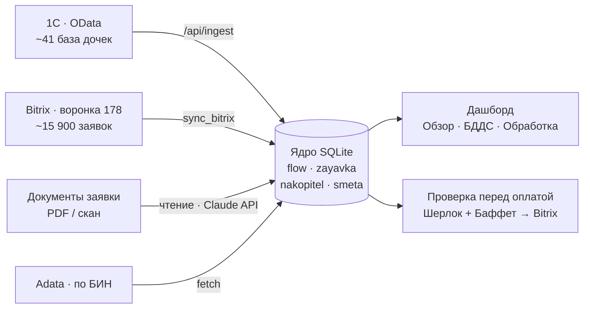
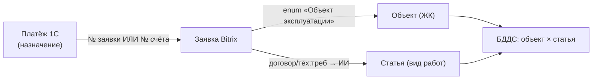
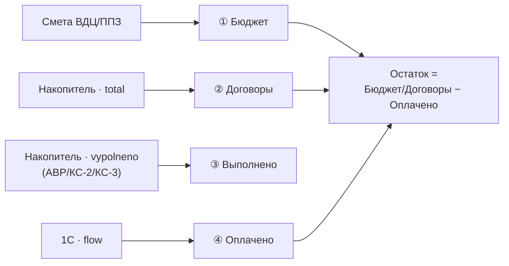
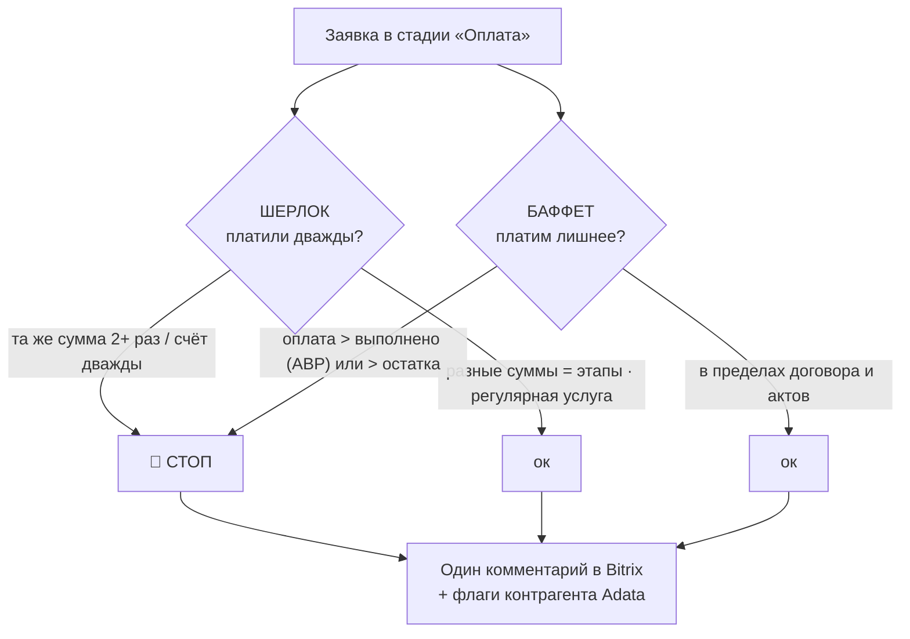

# ATAMŪRA Finance — сверка оплат и контроль долга (Шерлок + Баффет)

Финансовый контур холдинга ATAMŪRA. Тянет **оплаты из 1С** и **договоры из Bitrix** в единое
SQL-ядро, сверяет `платёж → БИН → договор → остаток`, ловит **дубли и риски ДО оплаты**, ночью
шлёт сводку и алерты в Telegram.

**Зачем.** Боль №1 учредителя: 5–6 директоров вручную ищут дубли и ошибки в оплатах, теряют дни,
ошибки → задержки на стройке. Система находит это за секунду. На пилоте (Аксай Резорт) на живых
данных нашла **7 кандидатов в дубли** и **40 млн ₸ оплаты без договора**, 100% платежей привязала к БИН.

---

## Из чего состоит

- **Источники:** 1С (OData, ~41 база дочек, одинаковая конфигурация «Бухгалтерия для Казахстана 3.0») + Bitrix (договоры).
- **Ядро:** SQLite — платежи, контрагенты, договоры, дубли (единый реестр).
- **Шерлок (дубли):** «не платим ли дважды?» — уже платили по заявке / тот же `БИН+сумма` в истории.
- **Баффет (переплата):** остаток `= договор − гар.удержание − бартер − оплачено`; красный флаг
  «оплата > выполнено (АВР)» — не платим за непринятые работы.
- **Доставка:** ночной джоб (Планировщик Windows) → Telegram (сводка + алерты). Модель «опрос»: сами спрашиваем 1С.
- **Панель:** реестр / светофор рисков / БДДС / Накопитель.

## Принцип

«**Факты, а не документы**»: ядро хранит факты (платёж / договор / остаток), дашборд — это экспорт
поверх ядра. Единый реестр-канон = Bitrix; 1С = источник оплат. Две «речки» не смешиваем:
**БДДС** (движение денег — наша зона) отдельно от **ПНЛ** (начисления — контур финансистов).

---

## Схемы работы с данными

**1. Откуда данные и куда текут**

**2. Как платёж находит свой объект и вид работ**

**3. БДДС — четыре ноги по объекту**

**4. Решение на стадии «Оплата» (Шерлок + Баффет)**

## Статус

- ✅ OData на ~41 базе холдинга, парсер сводит всё в одно ядро (`parser_1c_odata.py`, мульти-база `bases.json`).
- ✅ **Авто-сбор 1С** — Планировщик Windows на 1С-сервере, срез пушится сам (см. `DEPLOY.md`).
- ✅ Дашборд на finance.atamura.group: **Обзор / Платежи 1С / Сведение / Накопитель / БДДС / Обработка / Контроль**.
- ✅ Bitrix в ядро — **ВСЕ ~15 900 заявок** воронки 178 с объектом из enum-поля.
- ✅ **Чтение документов по содержимому** (не по полю): комбо-файлы АВР+КС+счёт, дедуп, ретраи, webp/heic.
  Вычерпывает статью/сумму/**выполнено (АВР)**/условия/БИН.
- ✅ **БДДС по объектам, 4 ноги** (Бюджет/Договоры/Выполнено/Оплачено): окно-разбор объекта, провал в
  вид работ → заявки → накопитель → Bitrix. Клик по дню в графике → платежи за сутки.
- ✅ **Обработка**: очередь оплаченных заявок, чтение по кнопке (параллельно, sonnet-5).
- ✅ **Проверка перед оплатой** (`precheck`): Шерлок (дубли) + Баффет (переплата/оплата>выполнено) +
  флаги контрагента из **модулей Adata** (аресты/фиктив/суды/розыск/санкции) — один комментарий в Bitrix.
- 🟡 Матч 2-я нога (платёж→счёт для 699 без № · отличать дубль от регулярной услуги) — см. `ЛОГИКА.md §6`.
- 🟡 Связка с Кроносом: задачи участникам процесса (юр/СБ/фин) во вкладке «Задачи» — `ЛОГИКА.md §8`.

## Как это работает

Доменная логика (потоки, чтение, БДДС, Шерлок/Баффет, Adata, Кронос) — **[`ЛОГИКА.md`](ЛОГИКА.md)**.

## Запуск / эксплуатация

Полная памятка (авто-сбор 1С, systemd, `.env`, маршруты, накопитель) — в **[`DEPLOY.md`](DEPLOY.md)**.

Коротко:
- **1С-сторона (один раз на базу):** опубликовать OData (IIS) → открыть состав объектов (`odata_setup.bsl`).
- **Парсер вручную:** `python parser_1c_odata.py` (конфиг — `bases.json`).
- **Деплой фин-ядра:** `git pull && sudo systemctl restart atamura-finance`.

---

## Дорожная карта

0. **Первый живой прогон** — парсер на 1 базе (сейчас).
1. **Ядро + сверка** — оплаты в ядро, дедуп-алерты, договоры из Bitrix, Накопитель.
2. **Автоматика** — ночной Планировщик + Telegram («падает само»).
3. **Размножить** — публикация на остальные базы, свод по холдингу.
4. **Панель** — реестр/светофор/Накопитель/БДДС на живых данных.
